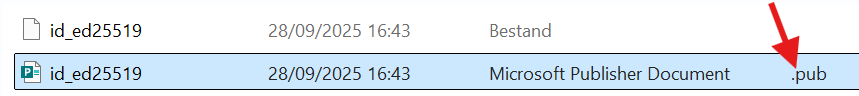

# Inloggen op een server via SSH

## ⚠️ Belangrijk

**Deel nooit je *private key*!**  
Bewaar die veilig op je eigen computer en upload ze **nooit** naar GitHub of andere platforms.

---

## 1. SSH-sleutel aanmaken

Open je **terminal** (macOS/Linux) of **PowerShell** (Windows) en voer uit:

```bash
ssh-keygen -t ed25519 -C "jouw_email@example.com"
```
> **Wat doet `-C "jouw_email@example.com"`?**  
> Dit voegt enkel een **label (commentaar)** toe aan de sleutel, zodat je later weet van wie of waarvoor ze is.  
> Je mag hier ook iets anders invullen, zoals:  `-C "laptop-ilse"` of `-C "ilse-pe2"`.  


- *Gebruik `-f` om zelf een bestandsnaam te kiezen:*

    **Windows:**
    
    ```powershell
    ssh-keygen -t ed25519 -C "jouw_email@example.com" -f .ssh/mijn_nieuwe_key
    ```
    
    **Linux/macOS:**
    
    ```bash
    ssh-keygen -t ed25519 -C "jouw_email@example.com" -f ~/.ssh/mijn_nieuwe_key
    ```

Druk bij elke vraag gewoon op **Enter** om de standaardinstellingen te gebruiken.


---

## 2. SSH-Sleutels verplaatsen (indien nodig)

De net aangemaakte sleutels staan normaal gezien automatisch in de map **.ssh**.
Indien niet, verplaats **beide** bestanden (private en public key) naar:

* Windows: `C:\Users\<naam>\.ssh\`
* Linux/macOS: `~/.ssh/`

---
## 3. SSH-configuratiebestand maken
Een `config`-bestand laat je verbinden met een **alias**, zodat je niet telkens het IP of pad naar je sleutel hoeft in te geven.


### Stap 1: Ga naar de map `.ssh`

### Stap 2: Maak (of open) een bestand `config`

Open een teksteditor (bijv. Notepad), plak deze inhoud erin en pas aan:

```ssh
Host projectnaam                # vrije naam, zelf te kiezen
    HostName 89.168.87.161      # IP-adres van je server
    User ubuntu                 # gebruikersnaam
    Port 22
    IdentityFile C:\Users\<jouw_naam>\.ssh\id_ed25519  # pad naar je private key
    IdentitiesOnly yes
```
**Linux/macOS**: 
- pas het pad aan, bv.
```
IdentityFile ~/.ssh/id_ed25519
```
    
- Stel de juiste rechten in
    
```
chmod 700 ~/.ssh
chmod 600 ~/.ssh/id_ed25519
chmod 644 ~/.ssh/id_ed25519.pub
```  

**Sla het bestand op als `config` (zonder extensie)**  (dus **niet `.txt`** of iets anders)
Plaats het in je `.ssh`-map.

```
C:\Users\<jouw_naam>\.ssh\config
```

---

## 4. Verbinden met de server
**Indien je publieke sleutel nog niet is toegevoegd op de server**, volg dan eerst dit stappenplan:
[Stappenplan sleutel toevoegen aan de server](./teamleden_toevoegen_linux_cloud.md)

**Is je sleutel al toegevoegd?**  
Ga dan verder hieronder

Open een **terminal of PowerShell** en typ:

```bash
ssh projectnaam
```

Als alles goed ingesteld is, log je meteen in op de server zonder IP of `-i`-optie.

---

## 5. Publieke sleutel in de Vault plaatsen


1. Ga naar [https://vault.vives.live/](https://vault.vives.live/)  
2. Open je publieke sleutel (het bestand dat eindigt op `.pub`) met een teksteditor.  
3. Kopieer de volledige inhoud.  
4. Voeg die toe in je **Vault** (bijv. als *SSH Public Key je_naam*).

Zo blijft je sleutel veilig bewaard en kun je ze later makkelijk terugvinden.



---
## Tips

Als je meerdere servers beheert, kun je in hetzelfde `config`-bestand meerdere *Host*-blokken toevoegen:

```ssh
Host webserver
    HostName 192.168.0.10
    User deploy
    IdentityFile ~/.ssh/webserver_key

Host database
    HostName 192.168.0.11
    User postgres
    IdentityFile ~/.ssh/db_key
```

---

